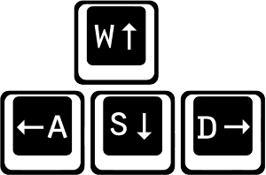
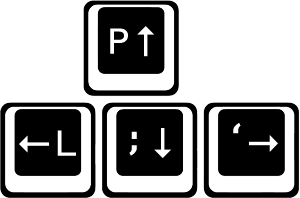

# Whack-a-Troll

[Live Link Here][liveLink]

![screenshot]

Whack-a-Troll is a take on the classic game, using JavaScript to control an
HTML canvas element. Enjoy!

[liveLink]:https://emwads.github.io/whack-a-troll/
[screenshot]: image/wat.png

## Gameplay
In whack-a-troll, you have 30 seconds to smack as many trolls as you can with your trusty hammer... Just be sure not to smack the cute little moles while you're at it! You receive 10 points for every troll you smack and lose 10 points for every mole you hit.

There are two modes:

- In 2 player mode, you can battle it out for the title of the best troll remover against a friend, using the player 1 and player 2 controls below.
- In 1 player mode, you can play against the computer using the 1 player controls below.

### Controls

#### Player 1:

Keys:
- 'w', 'a', 's', 'd' for movement
- 'q', 'e' for hitting

#### Player 2:

Keys:
- 'p', 'l', ';', ''' for movement
- 'o', '[' for hitting

## Features

- Includes a picture loader to ensure all images are ready before a player can start the game.
- Utilizes the keymaster library to get user input.
- AI is programmed to move around randomly until it can find a whackable troll in an adjacent location.
